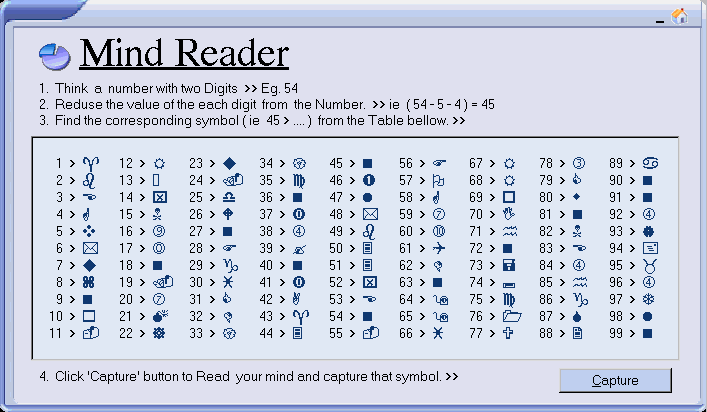



## \[  Mind  Reader  \] \- New Update

### Description

This is an example to show 'How to load controls at RunTime', with an interesting 'Mind Reader' Program.-Rate- this program as an Entertainer.Don't forget to add your feedback
 
### More Info
 

             |
---                |---
**Submitted On**   |2004-12-04 08:40:58
**By**             |[JJJJJJJJ](https://github.com/Planet-Source-Code/PSCIndex/blob/master/ByAuthor/jjjjjjjj.md)
**Level**          |Beginner
**User Rating**    |4.3 (117 globes from 27 users)
**Compatibility**  |VB 6\.0
**Category**       |[Games](https://github.com/Planet-Source-Code/PSCIndex/blob/master/ByCategory/games__1-38.md)
**World**          |[Visual Basic](https://github.com/Planet-Source-Code/PSCIndex/blob/master/ByWorld/visual-basic.md)
**Archive File**   |[\[\_\_Mind\_\_R1825691252004\.zip](https://github.com/Planet-Source-Code/jjjjjjjj-mind-reader-new-update__1-57560/archive/master.zip)

